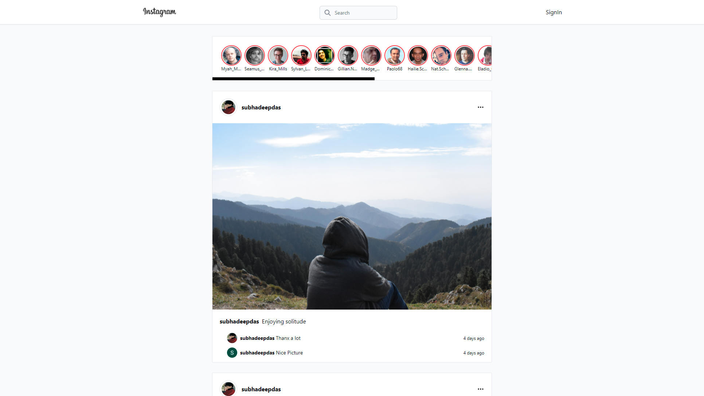

# Instagram clone using Next JS, Tailwind CSS, Faker Js, Firebase, with state management using Recoil and authentication using NextAuth:-
This is an instagram clone that has been developed using Next JS together with Tailwind CSS. It uses Faker Js to implement fake user data in suggestions and stories. The NextAuth feature of Next js has been used for authentication with google account. It uses Recoil instead of Redux for state management and user profile saving inside the application. It also uses Firebase for the realtime database feature.

# What i learnt in this project:-
1) Implementing Google authentication using NextAuth.
2) Implementing Faker JS to create fake user data.
3) Implementing Tailwind-scrollbar in Tailwind CSS.
4) Working with Recoil for state management.
5) Better understanding of NextJs and its features.  


# Live version of the app:- [Link](https://instagram-clone-subhadeep-das.vercel.app/)

## Note:- Please do log out of the app before exiting. To Log out simply click on your profile picture on the top-right!!

# Screenshots of the app:-
<p><b>Landing Page:-</b></p>

<p><b>Login Page:-</b></p>

<p><b>Basic Post:-</b></p>

<p><b>Home page of logged-in user:-</b></p>


# Next.js + Tailwind CSS Example

This example shows how to use [Tailwind CSS](https://tailwindcss.com/) [(v2.2)](https://blog.tailwindcss.com/tailwindcss-2-2) with Next.js. It follows the steps outlined in the official [Tailwind docs](https://tailwindcss.com/docs/guides/nextjs).

It uses the new [`Just-in-Time Mode`](https://tailwindcss.com/docs/just-in-time-mode) for Tailwind CSS.

## Preview

Preview the example live on [StackBlitz](http://stackblitz.com/):

[](https://stackblitz.com/github/vercel/next.js/tree/canary/examples/with-tailwindcss)

## Deploy your own

Deploy the example using [Vercel](https://vercel.com?utm_source=github&utm_medium=readme&utm_campaign=next-example):

[](https://vercel.com/new/git/external?repository-url=https://github.com/vercel/next.js/tree/canary/examples/with-tailwindcss&project-name=with-tailwindcss&repository-name=with-tailwindcss)

## How to use

Execute [`create-next-app`](https://github.com/vercel/next.js/tree/canary/packages/create-next-app) with [npm](https://docs.npmjs.com/cli/init) or [Yarn](https://yarnpkg.com/lang/en/docs/cli/create/) to bootstrap the example:

```bash
npx create-next-app --example with-tailwindcss with-tailwindcss-app
# or
yarn create next-app --example with-tailwindcss with-tailwindcss-app
```

Deploy it to the cloud with [Vercel](https://vercel.com/new?utm_source=github&utm_medium=readme&utm_campaign=next-example) ([Documentation](https://nextjs.org/docs/deployment)).
